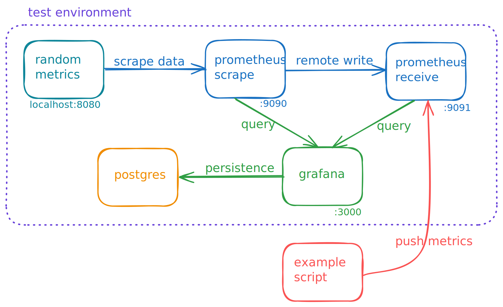
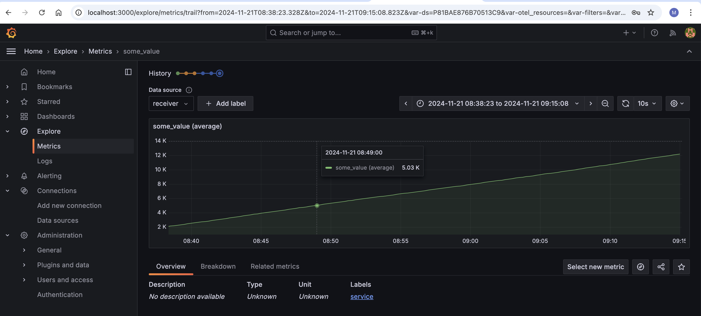
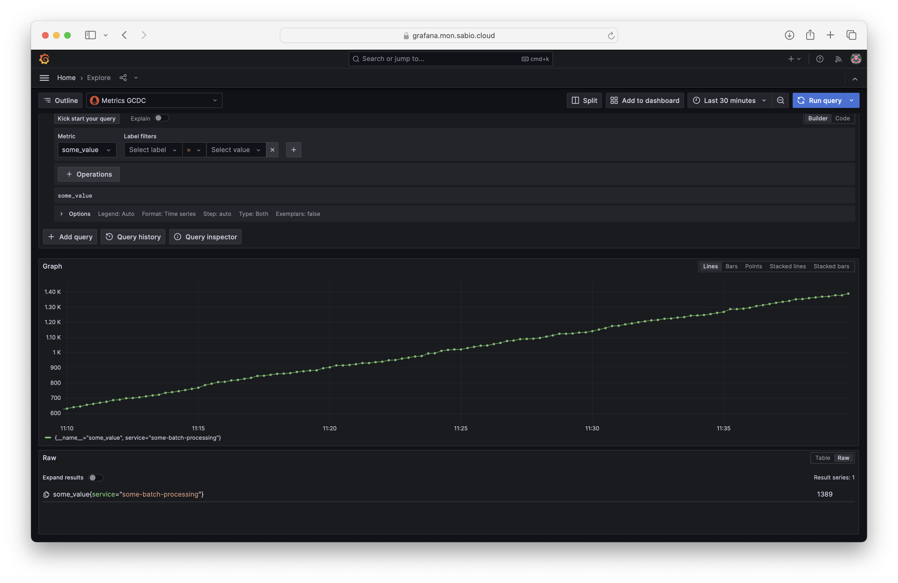

# Metrics Remote Write PoC

## Overview

Example script to demonstrate pushing ad-hoc metrics into Mimir/Prometheus.

## Requirements

- docker and docker-compose are required to run the test environment.
- example script was developed and tested with `node v20.18.0` and `npm 10.8.2`
- run `npm install` in the `example script` folder

## Test Environment

The `docker-compose.yml` will provision the following test environment:

In this environment `prometheus-scrape` is configured to scrape the `/metrics` endpoint of `random-metrics` as well as remote write the same metrics to `prometheus-receive`. Both of these Prometheus instances are data sources in Grafana `user: admin, password: Password123`. This setup allows for local testing of pushing metrics ad-hoc metrics into Prometheus as well as creating associated dashboards in Grafana.

## Push Metrics

To push metrics into the test environment set the `remoteWriteURL` const in `example-script/index.js` to the remote write endpoint of the `prometheus-receive` instance: `"http://localhost:9091/api/v1/write"`

Run `node example-script/index.js` and an ever-increasing counter value will be pushed to Prometheus, the metric name will be `some_value` and a label `service` with the value `some-batch-processing` will be added. This metric can be queried for in Grafana Explore with the data source set to `receiver`

Editing the example script to have the remote write endpoint of `"https://metrics.mon.sabio.cloud/api/v1/push"` will result in the metrics being pushed to the [Managed Services Mimir](https://grafana.mon.sabio.cloud) instance.

Access to this environment is granted via Github and membership of the Sabio Engineering Product team. Set the data source dropdown to Metrics GCDC to visualise metrics.

